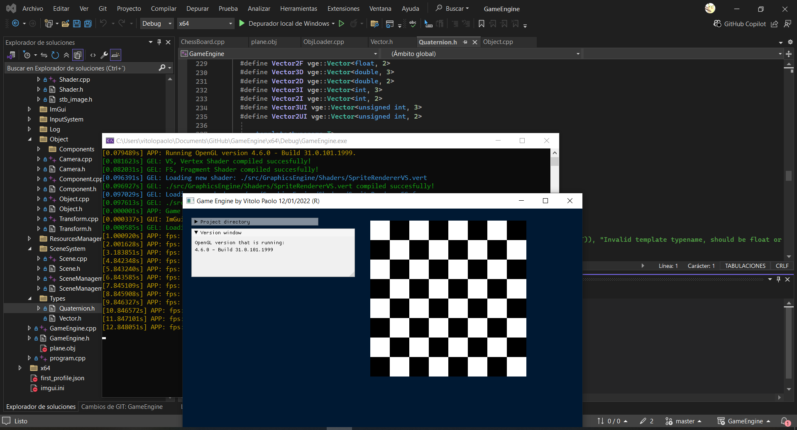
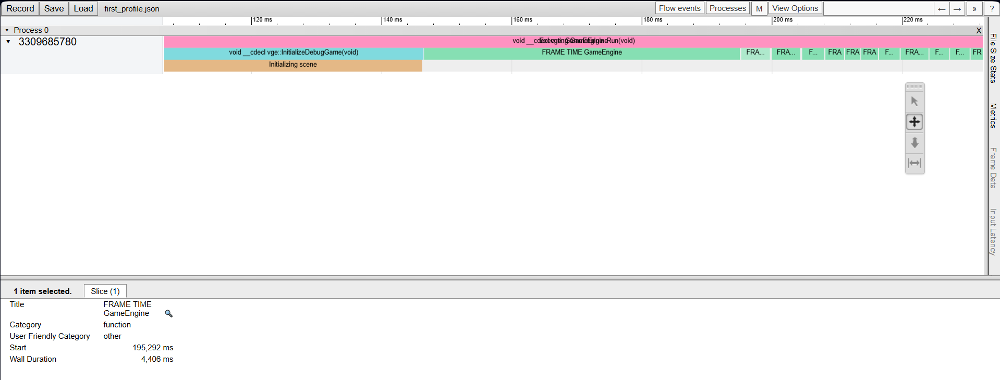

# GameEngine from Scratch

A minimal C++ & OpenGL game engine built from the ground up, featuring:
- Window & context creation with GLFW & GLEW  
- Custom OBJ loader (vertices, normals, UVs)  
- Scene graph with transform hierarchy  
- Immediate‑mode GUI via ImGui  
- Basic rendering pipeline (shaders, VAO/VBO)  
- Example “ChessBoard” procedural mesh  
- FPS counter & logging system  

---

## 📷 Gallery


### 1. Chessboard Example (Procedural Grid)  


### 2. Profile example  


### 3. Engine Initialization & Shader Compile Log  

---

## 🚀 Features

1. **Core Systems**  
   - **`GameEngine::Init()`**: Initializes GLFW, creates window/context, queries OpenGL version.  
   - **Logging**: Colored console output for Debug, Warning & Error.  
   - **FPS Counter**: Tracks & displays frame rate in real time.

2. **Mesh Loading**  
   - **`ObjLoader`**:  
     - Supports `v`, `vn`, `vt`, and triangulated `f v/t/n v/t/n v/t/n`.  
     - Parses multi‑indexed OBJ into flat arrays for OpenGL draw calls.  
   - **Example**: `plane_triangle.obj` (triangulated plane).

3. **Scene Graph**  
   - Base **`GameObject`** with `Transform` component (position, rotation, scale).  
   - Hierarchical `addChild(...)` relationships.  
   - Example: **`ChessBoard`** class generates an 8×8 grid of alternating colored squares:
     ```cpp
     for (int i = 0; i < 8; ++i)
       for (int j = 0; j < 8; ++j)
         createSquare((i+j)%2, i, j);
     ```

4. **Rendering Pipeline**  
   - GLSL **Vertex** & **Fragment** shaders  
   - VAO/VBO setup & `glDrawElements`  
   - Depth & color buffer clear each frame.

5. **GUI Integration**  
   - **ImGui** panels for:  
     - Project directory browser  
     - OpenGL version info  
     - FPS & stats  
   - Live tweaking of transforms & material properties.

---

## 🛠 Getting Started

1. **Clone the repo**  
   ```bash
   git clone https://github.com/VictorPlaSanchis/GameEngine.git
   cd GameEngine
   ```

2. **Dependencies**  
   - [GLFW](https://www.glfw.org/)  
   - [GLEW](http://glew.sourceforge.net/)  
   - [GLM](https://glm.g-truc.net/)  
   - [ImGui](https://github.com/ocornut/imgui)  

3. **Build**  
   Use your favorite CMake + Visual Studio / Makefiles / Linux toolchain:
   ```bash
   mkdir build && cd build
   cmake ..
   cmake --build .
   ```

4. **Run**  
   ```bash
   ./GameEngine
   ```

---

## 📂 Project Structure

```
GameEngine/
├─ src/
│  ├─ Core/             # GameEngine init, main loop
│  ├─ Object/           # GameObject, components, Transform
│  ├─ Resource/         # ObjLoader, shader loader
│  ├─ Scene/            # Scene management & example scenes
│  ├─ UI/               # ImGui integration
│  └─ Types/            # Vector, Quaternion, utility types
├─ shaders/             # GLSL shader source files
├─ plane_triangle.obj   # Example triangulated plane mesh
├─ gameengine1.PNG      # Init & log screenshot
├─ game‐engine‐example.PNG # Chessboard demo screenshot
└─ README.md
```

---

## 📝 Usage Examples

### Loading an OBJ
```cpp
auto model = vge::ObjLoader::get()->loadObj("plane_triangle.obj");
model->assignVertexs(...);
```

### Creating a ChessBoard
```cpp
vge::ChessBoard board({0,0}, 8.0f);
scene->addChild(&board);
```

---

## 🔮 Future Work

- Texture/material system  
- Camera controls & multiple viewports  
- Lighting (Phong, PBR)  
- Animation & skinning  
- Physics integration  
